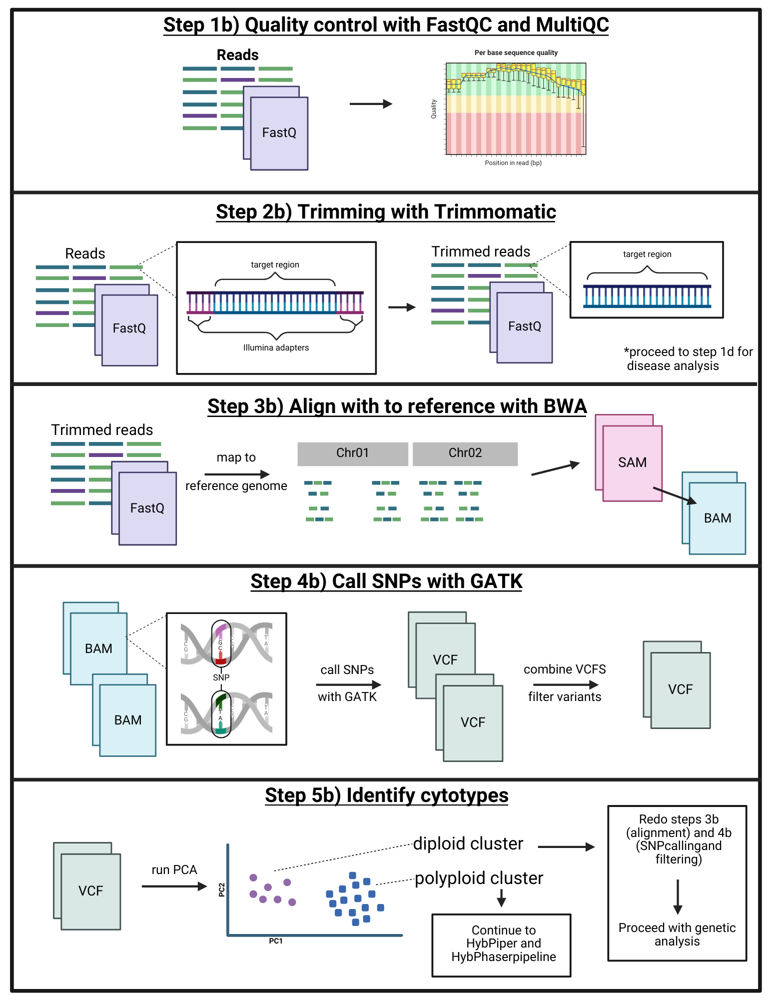
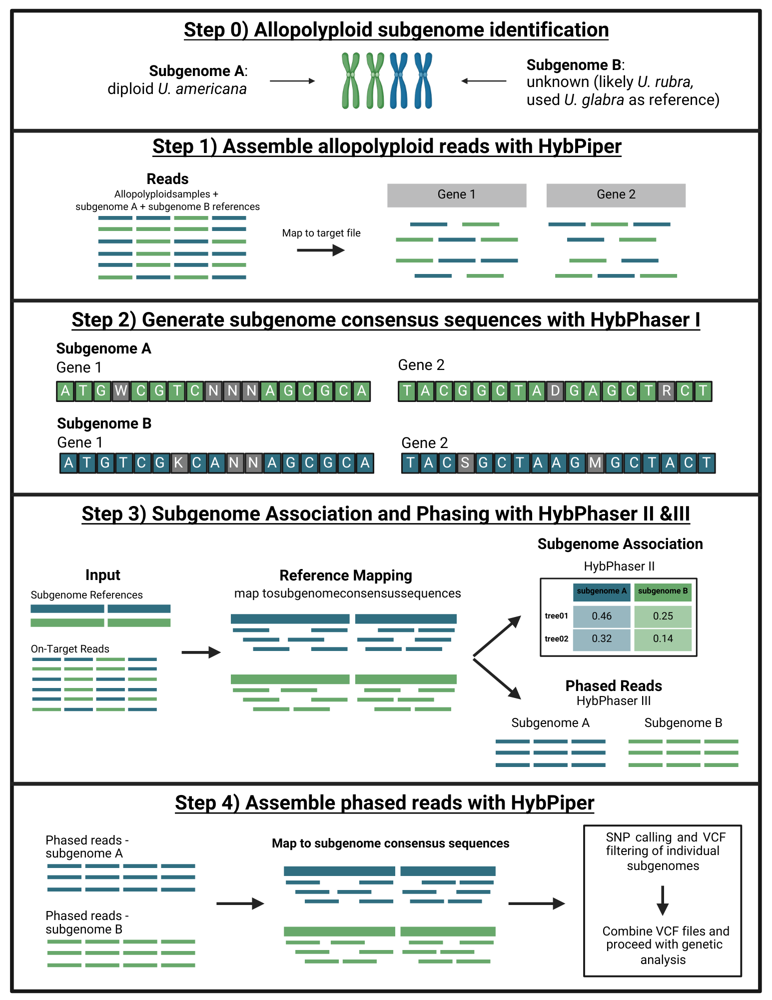

# American Elm Genetic Analysis
Polyploid complexes, like American elm (*Ulmus americana*), are fairly common, but there are very few analysis pipelines designed to handle this. Hopefully, this technique will be helpful for other organisms that have similar polyploid problems. So, I want to start off with some basic background on American elm and what we know about the polyploid problem. We know that American elm can have four different ploidy levels: 2n, 3n, 4n, and 5n. Tetraploids are the most common, followed by diploids. Then triploids and pentaploids are rare, with only one or two of each (supposedly the triploid 'Jefferson' is fertile and very resistant to Dutch elm disease). Diploids and tetraploids are found across the southern part of the range, and even occur in the same stands. There are no published studies attempting to cross the cytotypes, so it seems improbable, but since the triploids exist, it might be possible. We also don't know if the polyploids are autopolyploids (the result of genome duplication) or allopolyploids (the result of hybridization with two distinct subgenomes). After concluding the analysis for this project, we are fairly certain they are allopolyploids, but still don't have confirmation of who the progenitors are.

I am a strong believer in reporting failures as well as successes, so I am going to try to report everything I tried and didn't work. My goal is not to put down any of the programs that didn't work, just let others know what did and did not work well for my dataset. Feel free to reach out to me if you want to chat more about this.

### Is this pipeline applicable to your data?
So, if you find yourself with a polyploid complex and target enrichment data, this pipeline might be useful for you. Also, if you have an allopolyploid with two *very distinct* (so distinct that SNP callers throw away reads from the other sub genomes), then this might be useful for you (check out part 3!). Also relevant, I used a custom amplicon panel designed specifically for American elm.

## Part 1) Split Cytotypes
The statistics to analyze a mixed ploidy dataset do not exist yet. There are a few ways to handle this; one of which is assuming all the individuals are diploids, but this is *statistically illegal* (no judgment here, I almost did this). The problem arises during SNP-calling because the programs available can only handle one cytotype at a time. Even so, a lot of SNP calling programs really struggle with polyploids (as discussed in part 3). I opted to separate the cytotypes and analyze them completely separate. This works well for my dataset since I have two dominant cytotypes (2n and 4n).

To do this, I used a PCA. I had individuals with known ploidy, as confirmed with flow cytometry. The trees with known ploidy are living at the National Arboretum in Maryland. I also tried using k-mer plots, flow cytometry (dried leaves **do not** work), ploidyNGS, nQuire, nQuack and PCA. nQuack was the best, and I think the problem was with how I was implementing it, but a PCA was the most accurate for my data, and the quickest.

The scripts I used for this section are in a folder titled "part1_scripts".

### Step 1b) Quality Control
  Of course, once I got sequence data back, I ran FastQC and MultiQC. This is just to make sure that sequencing was successful. The associated scripts for this are 1b_fastqc.sh and 1b_multiqc.sh.
### Step 2b) Trimming
  This step removes the Illumina adapters used for sequencing. The associates scripts are 2b_trimmomatic.sh
### Step 3b) Alignment
  The associated script here is 3b_alignment.sh. This starts with adding the programs to the conda environment and indexing the genome*. Then, it runs an alignment with BWA, converts the sam file to a bam file, sorts the bams, then generates a flagstat report for each individual. There are ways to consolidate all of the individual flagstat reports into one, but I usually just click through a few to make sure nothing failed too terribly. There is code included here to run PrimerClip, I didn't use this in the final version, but included it just in case. Primerclip only works if you have a primerfile and align to the reference fasta of gene regions, not the whole genome. So, I just didn't use it.
  
  *a quick note about the genome: I used the haplotype 2 of an assembled diploid *U. americana* genome on Phytozome [here](https://phytozome-next.jgi.doe.gov/info/Uamericanavar_NA87034HAP2_v1_1). Since this amplicon panel includes gene regions from *U. americana*, and a handful of disease genes (see my other github for more information), I ran a comparison to see if any of the disease genes were found in the genome. There was one gene region derived from Phytoplasma that was found in the genome, so I masked that and continued as normal.
### Step 4b) SNP calling and filtering
  Here is where we start venturing into the *statistically illegal* territory. At this point, we still don't know the ploidy of each individual, so we assume it is diploid. This is bad for a bunch of reasons that I won't get into here. So, for the sake of determining cytotypes, we are going to assume everything is a diploid. Keep in mind, this whole pipeline took about two weeks to run to completion, so I highly recommend increasing the computational power. I did this a few different ways. First, you can increase the number of threads. Second, try increasing the heap that you use. I didn't see too much of a change in speed even when bumped up to 256gb. Finally, you can try using parallels. This will run multiple samples at the same time. Just be careful that you don't overextend your server because it'll crash (this happened to me). 
  The 4b_gatk_pt1.sh pipeline creates all the output folders that you need. First, it sorts the bams into the format needed for GATK. Then it marks duplicates and adds read groups. Finally, it runs GATK HaplotypeCaller which outputs GVCFs for each individual. Then, I ran 4b_gatk_pt2.sh which combines the GVCFs into a cohort VCF and called SNPs with GATK GenotypeGVCFs. Finally, I ran three different levels of SNP filtering in 4b_snp_filter.sh. 
### Step 5b) PCA to determine cytotypes
  Here, we use plink to prune for linkage then run the PCA in script 5b_PCA_pt1.sh. I download those files onto my laptop and run the next script 5b_PCA_pt2.Rmd (an R markdown) in Rstudio. It has code to graph the PCA, assign the cluster, and test the watershed hypothesis. Based on which PCA had the most individuals of known cytotypes, I was able to determine which cluster is for diploids and polyploids. There was another cluster that I called "other" and removed those individuals because they are likely other species. Then, I saved a csv file with the individuals in each cluster and exported that back to the server and separated the diploids into one folder, and polyploids into another. Congrats! Now the cytotypes are separate and each can be analyzed. This can be done with script 5b_PCA_pt3.sh, but make sure you convert the file to the proper format with dos2unix first! This will read the names of the files and move them into the correct folders based on the csv lists.

## Part 2) Analyze Diploids
  This part is easy compared to the polyploids. All that is needed is to recall the SNPs. So, I included the slightly modified scripts from part 1 that will run GATK. The input is the bam files with the read groups, and it runs HaplotypeCaller on 2 samples at once with parallels. Then you combine the GVCFs and genotype it with the script 2_gatk_pt2.sh. Then the VCF is filtered and pruned for linkage. Finally, I ran a PCA and ADMIXTURE on the diploids. This is done in script 3_analysis_pt1.sh. The last part is all of the fun data analysis in Rstudio. This is in the R markdown script titled 4_analysis_final.Rmd. This includes everything from graphs to diversity analysis to landscape genetics. So that's it for the diploids!

## Part 3) Analyze Polyploids
### Polyploid Problems!
  So, this is where things get interesting. SNP callers are terrible at calling SNPs on polyploids. First, I tried doing the exact same thing as I did with the diploids (GATK for the whole pipeline), but I ended up with VCF files with 0 (yes ZERO) heterozygous loci. So then I tried FreeBayes, and it was still suspiciously low. VarScan doesn't work with polyploids, but even with diploid parameters, there was still very little heterozygosity. I ended up visualizing the reads and VCF files in JBrowse to see what was going on. We noticed there were two strongly divergent groups of reads. This was weird. Based on this (and a few other clues), we determined that American elm is an allopolyploid with two very divergent subgenomes. This led me to the conclusion that the SNP callers were throwing away the reads that mapped to the second subgenome. Obviously, this is a problem.
  Ultimately, we decided to phase the reads to their respective subgenome with HybPiper and HybPhaser. This also helps with downstream data analysis because it turns a polyploid into a diploid! So then you can use all of the same programs designed for diploids. Let's get started!

### Step 0) Subgenomes
So there are no associated scripts here because this is all based on ecology and phylogeny. We are fairly confident that tetraploid American elm is an allopolyploid with two very distinct subgenomes. We can assume that the first progenitor for a subgenome is diploid American elm. We don't know who the other progenitor of the second subgenome is! Based on range overlap, I think that *Ulmus rubra* is most likely the other progenitor. Phylogenetically, it could be *Ulmus laevis* since that is the closest relative, but that is a European species. We continued under the assumption that *U. rubra* is the second progenitor. Unfortunately, the *U. rubra* I included in my data set was actually a tetraploid American elm, so the closest relative I had was *U. glabra*. 

### Step 1) Assembly
For the diploids, I did something a little bit different; however, this time we are going to use HybPiper ([link here](https://github.com/mossmatters/HybPiper)). Make sure to look at the HybPiper logo, it's incredible. HybPiper is very easy to use as long as your target file is in the right format (I included the one that I used named target_file2.fasta). The code for this part is in the part3_scripts folder and titled step1_assembly. Hybpiper does a lot of things, but the important part here is that it aligns the reads to the reference file.

### Step 2) Subgenome Consensus Sequences
Ok so now we move into using HybPhaser ([link here](https://github.com/LarsNauheimer/HybPhaser)). All of the scripts I used are on that github, but I will add them here too. The config.txt file is in the folder as well. This has all of the parameters that HybPhaser needs to run. First, HybPhaser geneerates consensus sequences for each gene in each individual.

### Step 3) Phasing
The associated scripts here are all named step3_somthing. Run them in order. The output here is a table with the percentage of reads from each individual that map to each subgenome. Finally it phases the reads so you should have one file with reads that map to subgenome A and one file with reads that map to subgenome B.

### Step 4) Assemble Phased Reads with HybPiper and Analyze
Now that we have the reads phased, each individual should have two fastq files. In my case, this is a file of reads from the diploid subgenome (dip) and the reads from the *U. glabra* subgenome (glabra). After this, we are going to run each script on the subgenomes independently, then combine the vcf files in R. I am only going to include the scripts for the diploid subgenome, so alter them as needed to match the file paths for the other subgenome. 

But first, we need a reference for each subgenome. Luckily, HybPhaser created that when it generated the consensus sequences. These sequences have ambiguity, and SNP callers can't read that. There is a python script (step4a_convert_ambiguity.py) that randomly selects one of the possible nucleotides that could be present where the ambiguity is. This is what the reads will be mapped to. HybPhaser outputs interleaved reads, so they need to be converted into R1 and R2. The script to do that is step4b_split_fastq.sh. Next, I used HybPiper again to align the reads to the subgenome reference. I also ran multiple samples at once with parallels to make it go a little quicker. This needs to be done for both subgenomes but I only included the scripts for the diploid subgenome since the are identical except with different paths. To combine the VCF files from each subgenome, I imported the files into Rstudio and stacked them on top of each other. Then I exported the big VCF file back to the server to run ADMIXTURE and a PCA with plink. The combine VCFs step can be found in the 4e_tetraploid_phasing.Rmd. The script for the PCA and ADMIXTURE is titled 4e_admixture_pca.sh. The code to visualize the PCA and ADMIXTURE results are in the R markdown that includes the combine VCF step (4e_tetraploid_phasing.Rmd).

### Yay! That's everything! If you have any questions don't hesitate to contact me.
